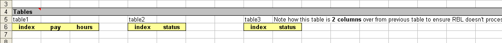

TODO: rble macro language content

TODO: link to
	Tables Section or ResultBuilder Framework (two diff links)


# RBLe CalcEngines

The spreadsheets used to perform the complex actuarial calculations or business logic for KAT products should originally be converted to a RBLe CalcEngine (CE).

Minimally, they will contain three RBLe Framework tabs:

- RBLInfo 
- RBLInput 
- RBLResult 

If the CE is also being used for an administration site, there will be an RBLBenCalc calculation tab as well. You can have as many result tabs as you'd like and you may or may not have some RBLUpdate tabs depending on whether you have a Calculated Data Load specified for an administration site.

- [RBLe Tabs](#rble-tabs) - Discusses the different RBLe tab types, standard table processing rules, structure, and features available in generating results for RBLe clients.
- [Calculation Pipelines](#calculation-pipelines) - Discusses how multiple CalcEngines can be 'chained' together feedings the 'results' from one CalcEngine into the 'inputs' of the next CalcEngine in the pipeline before generating the final result.
- [Creating/Maintaining CalcEngine Guidelines](#creatingmaintaining-calcengine-guidelines) - Discusses the guidelines for creating and maintaining CalcEngines.

[Back to RBLe Framework](RBLe.md)

## RBLe Tabs

There are three categories of tabs in a RBLe CalcEngine: informational, input, and result tabs.  Each tab has a specific purpose and structure to enable the RBLe Framework to process the data correctly.  And each tab can have its own set of 'switches' and 'special' column and table names to control how the data is processed.

### Required RBLe Tab Named Ranges

Every RBLe CalcEngine tab **requires** the following named ranges to be properly identified as a RBLe tab.

Name | Description
---|---
SheetType | The type of sheet; `Input`, `ResultXml`, `FolderItem` or `Update`.  The `FolderItem` and `Update` sheet types are only used in administration systems. `FolderItem` sheet results are automatically saved to the xDS data store and `Update` sheet types are used to provide instructions on how to update data during a batch 'calculated data load'.
FolderItemType | When the sheet type is `FolderItem`, specify the type to use when saving the results.  If blank, then the tab will *not* be processed.
FolderItemReplace | Control how previous results of the same type are processed when saving the results.<br/><br/>`true` - Replace all previously saved results with current.<br/>`false` - Keep all previous results when saving current.<br/>`KeepN` - `N` is a number of previous results to keep (newest to oldest) before saving current results.
StartData | Indicates the start of 'data' elements and 'input' elements on `Input` tabs.  Must be in column `A` of a worksheet and appear *before* `StartTables`.  This cell appears one row before the first data or input element.  This named range is required on non-input tabs as well, even though there are never any items in this section; only tables are present in non-input tabs.<br/><br/>The section ends when the `StartTables` named range is encountered or when two blank rows are encountered.
StartTables | Indicates the start of 'table' configurations on RBLe CalcEngine tabs.  Must be in column `A` of a worksheet and appear *after* `StartData`.  This cell appears one row before the configuration of the first table.<br/><br/>Tables are configured with a table name and any configuration switches in one cell, then in the row immediately following, all the column names are defined until a blank column is encountered.  The RBLe Framework then continues to look for additional table configurations with only a single blank column seperating tables until two blank columns are encountered.
Inputs | `ResultXml` tabs only; RBLe Framework calculations allow specifications of *one* input tab and *one or more* result tabs.  When a CalcEngine has several result tabs, the single input tab can become quite large and cluttered.  To help encapsulate functionality, the 'input' tab in CalcEngines can be configured to only contain 'shared' information for all types of calculations (i.e. profile and history data, framework inputs, and/or shared inputs) while each result tab can contain a section to receive inputs that are specific to its tab.  To enable this feature, create a worksheet scoped named range called `Inputs` that appears in column `A` and *before* `StartData`.  It will be processed in the same manner as `StartData`; namely each row will be processed until two blank rows are encountered or `StartData` is encountered.


### RBLe Tab Types

RBLe CalcEngine tabs are either informational, input, or result.  Additionally, a result tab could have a more specific purose of being report or update tab.  This classification is controlled by the worksheet scoped `SheetType` named range.  Note that for 'informational' tabs, there is no `SheetType` named range, it simply has a global scoped `Version` named range.

#### RBLInfo – General Information Tab

The primary feature of this tab is to control the version number and change history of the CE. Whenever a CE is uploaded to the KAT Management Site (documentation of that feature is beyond the scope of this document), a new version number must be used. Your incrementing 'guidelines' can be decided on per client, but the version number must get higher on each upload. This version number is updated in the `Version` named range.

**Do name the informational tab `RBLInfo`.**

Although not required, it is recommended to name the informational tab `RBLInfo` to help identify the tab's purpose.  The name in conjunction with a worksheet scoped `VersionHistory` named range can enable automatic change log processing in the [KAT Tools Excel Add-in](ExcelAddIn.md).

**Do use numeric values in the Version named range.**

This cell is parsed as a number and compared to previous versions.  Ensure that valid numbers (decimals are allowed) are used. The version incrementing guidelines are up to Conduent/Client's discretion.

**Do use RBLInfo tab to keep a log of CE change history.**

Keeping an accurate change history can help Conduent recover a previous CE based on a version number if necessary. Currently KAT stores all previous versions of *Live* CEs (in future it may only store a certain number of previous versions), so if the change history log is accurately kept and a problem arises, Conduent could determine which version number they needed to rollback to.

#### General Tab Structure

There are many features available during RBLe Framework processing that are controlled via 'switches', special column and table names, or special values within a table.  All tables processed by RBLe Framework follow the rules described below.

Name | Location | Description
---|---|---
Case Specific | General | All configuration information (input name, table names, column names, switches) are case specific.
/work&#x2011;table<br/>/off` | Table Switch | By default, all tables on a CalcEngine tab are processed (until two blank columns are encountered).  To flag a table as simply a temp/work table that doesn't need to be processed, use the `/work-table` or `/off` switch on the table name.<br/><br/> **Note:** It is preferred to use the `/off` switch versus inserted two blank columns to disable a table because it allows for 'work tables' to be placed in the most logical position in CalcEngine tabs instead of being forced to always be at the end right of all tables and additionally, it allows for the KAT Excel Addin to navigate to these tables since the table configuration is detected before encountering two blank columns.
/off | Column Switch | Optional switch used on table columns to indicate that the column should not be processed during calculations
/sort&#x2011;field | Table Switch | To configure how the table data is sorted, use the `/sort-field:field[,direction,isNumber]` switch on the table name. `direction` and `isNumber` are optional parameters.  `direction` can be `asc` or `desc` (defaulting to `asc`) while `isNumber` can be `true` or `false` (defaulting to `false`).  To specify multiple columns to sort, provide a `\|` delimitted list of column configurations.  For example `/sort-field:status\|pay,,true\|year,desc,true` would sort by `status` *text* ascending, then by `pay` *number* ascending, then by `year` *number* descending.
/sort&#x2011;field Legacy | Table Switch | To configure how the table data is sorted, use the `/sort-field:field-name` switch on the table name.  To specify multiple columns to use in the sort, provide a comma delimitted list of field names.  When used on an _Input Tab Table_, the data is sorted _before_ it is loaded into the tab.  Conversely, when used on a _Result Tab Table_, the data is sorted _after_ exporting the results from the CalcEngine.
/sort&#x2011;direction Legacy | Table Switch | Optional sort control (`asc` or `desc`) used in conjunction with `sort-field`.  By default, data will be sorted ascending.  Use the `/sort-direction:direction` to control how field(s) specified in the `/sort-field` switch are sorted.  If `/sort-direction:` is provided, there must be the same number of comma delimitted values as the number of comma delimitted fields found in `/sort-field`.
/sort&#x2011;number Legacy | Table Switch | Optional switch (`true` or `false`) used in conjunction with `sort-field`.  By default, data will be sorted using a `string` comparison.  Use the `/sort-number:true` to indicate that field(s) specified in the `/sort-field` switch should be treated as numeric when sorting.  If `/sort-number:` is provided, there must be the same number of comma delimitted values as the number of comma delimitted fields found in `/sort-field`.

##### Tab Processing Flow

The RBLe Framework determines processing based on blank rows or blank columns. For Inputs and Data Section, processing starts at the `StartData` named range and processes each row until it encounters **two or more consecutive blank rows** or the `StartTables` named ranged. Every row must have a unique name in the the `id` column (column A). 

In the Tables section, processing starts on row below `StartTables` named range. It processes all field definitions for that table (listed on row below table name) until a **single blank column header is detected**. It looks for the next table by moving over one column and up one row from the previously detected blank column header (i.e. Range.Offset(-1, 1)). It will continue processing tables until the offset destination is blank (**two or more consecuritve blank columns after current table's field definitions**).

The following screen shot shows two tables (table1 and table2) that are processed and one table that is ignored (table3).



#### RBLInputs – UI / Data Input Tab

Input tabs are the main tabs in which Conduent and KAT collaborate together. It is also the most important tabs in terms of using the latest tab structure from KAT.Extensibility.Excel.xll to ensure proper configuration setup/processing on the KAT end.

When setting up a new site, this is only tab that needs to be ironed out before handing it over to KAT to being the set up process. If this tab is properly configured, KAT can then focus on getting the inputs built into the site's UI while at the same time Conduent can focus on getting the results ironed out.

Traditionally, there is only **one** input sheet per CE, but exceptions can be made. The only real argument for having separate tabs is to save processing time if one type of calculation has hundreds of inputs and/or data elements and another calculation only has a handful. It might make sense to separate them to benefit the 'smaller' calculation. If this is ever done, or if your single input sheet is not named `RBLInput`, **you need to explicitly tell KAT the inputs tab names** to ensure KAT configures their frameworks to properly process the correct tab.

The input tab is normally comprised of following sections described in more detail below: 

- Sheet Information – section that contains configuration information for the RBLe sheet. 
- Inputs (has a header of Inputs and Flat Data) - section that contains UI inputs provided by user. 
- xDS Data Fields - section that contains data elements pulled from xDS. 
- Framework Inputs – section that contains inputs provided by framework to provide contextual information for the calculation (type, user, page name, etc.) 
- Framework Variables (optional, placed in 'non-processing section' of see. See [Processing Flow](#tab-processing-flow).) – Any constants/variables Conduent developers which to define to use throughout calculation formulas. 
- Tables – section that contains tabular data, either tabular inputs (provided by user), historical xDS data (pulled from xDS), or global rate tables (pulled from xDS). 

The main thing you need to do in the *Sheet Information* section is change the `SheetType` cell to `Input`. It should be available in a drop down. Additionally, if you plan to use the [Load xDS Data into Input Tab](ExcelAddIn.md#load-xds-data-into-input-tab) utility, you can specify a value in the global scoped `ProfileLoadGroup` named range cell so that when you use the load utility, it will automatically default the value of the correct group name. You will probably have to consult with KAT to get the right group name but usually it is just the client name using Pascal naming convention.

During each calculation, all inputs and data items are cleared before loading the current inputs and data into the CalcEngine. Do not expect any defaults saved in the CalcEngine during development time to be persisted and used. If the calculation is part of a batch calculation (running several participants through a calculation), the inputs are only cleared and loaded on the first calculation. Each subsequent calculation only clears and loads the data elements (see [Input Tab Structure](#input-tab-structure) for more information).

##### Framework Inputs

Every calculation sends back a set of framework inputs that are set programmatically via the `KatAppOptions`, versus an actual input on the page.

Input | Description
---|---
iConfigureUI | A value of `1` indicates that this is the first calculation called after the markup has been rendered.  Can be turned off via `IKatAppOptions.runConfigureUICalculation`
iDataBind | A value of `1` indicates that all `rbl-listcontrol` and `rbl-defaults` should be processed to set default data bound values (note, this happens on the same calculation that sends `iConfigureUI=1`).
iInputTrigger | The name of the input that triggered the calculation (if any) will be passed.
iCurrentPage | Describes which page the calculation is being submitted from.  Passed from `IKatAppOptions.currentPage`
iCurrentUICulture | Specifies which culture should be when generating results.  Passed from `IKatAppOptions.currentUICulture`
iEnvironment | Specifies the environment in which the RBLe Service is executing.  Passed from `IKatAppOptions.environment` (`PITT.PROD`, `PITT.UAT`, or `WN.PROD`)


##### Input Naming Guidelines

The naming conventions discuss choosing the best names for the inputs in the *Calculation Inputs* section that come from site's UI on your CEs. Note that input names, data element names, table names, and table column names are all **case-sensitive** when coordinating tasks with KAT. Any grouping headers created in the 'Inputs and Flat Data' section are ignored by RBLe and processing will continue as long as two or more blank rows are not encounted (see [Processing Flow](#tab-processing-flow)). For example, the RBLInput tab could have headers *Calculation Inputs*, *xDS Data Fields*, *Framework Inputs*, etc. that are there simply for organization and readability purposes.

**Do prefix all input names with `i`.**

All inputs coming from a site's UI should be prefixed with an `i`. For example, a 'city' input on a site would be named `iCity`.

**Do use camel casing for all input names consisting of multiple words.**

The first letter in the name should be lower case and then, the first letter of each subsequent concatenated word are capitalized. You can use camel case for identifiers of three or more characters. For example, Date of Termination would be named `iDateTerm`.

**Do favor readability over brevity. The name `iVestServiceOver` is better than `iVOver` (an obscure reference to vesting service).**

**Do not use underscores, hyphens, or any other nonalphanumeric characters in input names.**

**Do not use abbreviations or contractions as parts of identifier names.**

For example, use `iHours` rather than `iHrs`. There are a few exceptions to this rule due to the wide use already in place. You can use `Cur` instead of `Current` (`iCurHours`), `Term` instead of `Termination`, `BenComm` instead of `BenefitCommencement`, `Ben` instead of `Beneficiary`, `Vest` instead of `Vesting`, `FAP` instead of `FinalAveragePay`, `SalScale` instead of `SalaryScale`, `Over` instead of `Override`, and `Bal` instead of `Balance`.

**CheckboxList Inputs**

CheckboxList inputs are special because if you have an input like `iPlanList` that is a checkbox list with values of 'Plan A' (value `1`), 'Plan B' (value `2`), etc. You can have 0 to N 'selected values'. Where all other types of controls, you only have one selected value. To account for this, you name the inputs a bit differently on the RBLInput tab. CalcEngines should use the 'input prefix' + 'item value' as the IDs. So in the sample mentioned earlier, it would be `iPlanList1`, `iPlanList2`, etc.

##### Input Tab Structure

There are many features available during RBLe Framework processing that are controlled via 'switches', special column and table names, or special values within a table.  Input tabs have the following features.

Name | Location | Description
---|---|---
`<data-element>` | `StartData` Element | Surrounding a term with `< >` indicates that data should be pulled from the current xDS data model. The term can be in one of the following three formats:<br/><br/>`profile-field` - Simply a name to a field present in Profile data.<br/>`HistoryTable:index:field` - Selector expression to query a specific row within historical data.  `index` can be a specific index value (must match exactly) or a positional based index; `first`, `last`, `first+N` or `last-N`. When using `first+` or `last-` if the expression results in an 'overflow' position (i.e. `first+10` but only 5 rows exist), then a blank value will be returned.<br/>`HistoryItem{XPath}` where `XPath` creates a valid XPath expression; i.e. `HistoryItem[@hisType='Pay'][position()=last()]/pay would select the most recent `pay` field.
`/text` | Element switch | Optional switch used on `<data-element>`, inputs, or input table columns to indicate that the provided data should be formatted as 'text'.  If `/text` is not provided and a textual value that can convert to a number is provided, the CalcEngine automatically parses the value as a number.  For example, if 'code' of `01` is provided without the `/text` flag, the CalcEngine would convert `01` to `1`.  With the `/text` flag, the leading `0` would be preserved.
`<dataTable>` | `StartTables` Element | Surrounding a table name with `< >` indicates that, for each calculation, the rows of the table will be cleared and populated with *data from the xDS history table* with the matching `dataTable` (i.e. `<Pay>`). The columns specified will popualte with the xDS History fields with the exact same name. There are a few exceptions:  a) the column  `id`, `index` and `hisIndex` will all function to populate with the 'index' field of the xDS History row, b) `@hisDateCreated`, `@hisDateUpdated`, `@hisCreatedBy`, and `@hisUpdatedBy` will populate with the associated xDS framework audit data items.
`<<globalTable>>` | `StartTables` Element | Surrounding a table name with `<< >>` indicates that, for each calculation, the rows of the table will be cleared and populated with *data from KAT CMS 'Global Lookups CalcEngine' table* with the matching `dataTable` (i.e. `<<IrsRates>>`). Only data from the columns specified will be popualted.
inputTable | `StartTables` Element | Surrounding a table name with `<< >>` indicates that, for each calculation, the rows of the table will be cleared and populated with data from KAT CMS 'Global Lookups CalcEngine' table with the matching `globalTable` (i.e. `<<IrsRates>>`). The columns specified will popualte with the global lookup fields with the exact same name.
inputTable | `StartTables` Element | A table name with *no wrapping characters* indicates that, for each calculation, the rows of the table will be cleared and populated with *tabular input data* provided from the UI (see [Input Table Management](../KatApp.md#input-table-management) for more information) with the matching `inputTable` (i.e. `RetirementDates`). The columns specified will popualte with the input table fields with the exact same name.
`[configureUiInputData]` | `StartTables` Element | Surrounding a table name with `[ ]` indicates that the table is a hybrid of a `<dataTable>` and an `inputTable`. When a calculation is an [`iConfigureUI` calculation](#framework-inputs), the rows of the table will be cleared and populated as if it were a `<dataTable>`.  For all other calculations, the rows of the table will be cleared and populated as if it were an `inputTable`.  This enabled a 'single input table' to be referenced in the CalcEngine an 'input table' is managed by the UI but initially populated by 'matching' data saved in xDS data store. The most common example of this is an 'UI Input Table' that has the capability of being saved to xDS and reloaded into the UI in a subsequent user session.
/unique&#x2011;summary:sourceTable | Table Switch | The RBLe Framework supports automatic 'grouping' to produce a unique list of values for input tables (`inputTable`, `<dataTable>`, or `<<globalTable>>`).  The `sourceTable` parameter indicates which table/data aggregate before loading it into the current table. See [Unique Summary Configuration](#unique-summary-configuration) for more information.
/id&#x2011;locked | Table Switch | The RBLe Framework allows loading only specific xDS History data rows based on indexes that provided the desired row indexes to load in an `id` column of the table, *which must be the first column specified* in the table. The index value provided in the `id` column can be a specific index value (must match exactly) or a positional based index; `first`, `last`, `first+N` or `last-N`. When using `first+` or `last-` if the expression results in an 'overflow' position (i.e. `first+10` but only 5 rows exist), then no row data will be populated. See [id-locked Configuration](#id-locked-configuration) for more information.

##### Calculated Expression Values

**TODO**: Still need to document `<original-*>` fields and `<original-*>` tables.

##### Sample Table Configuration

```xml
<xDataDef id-auth="111111111">
    <HistoryData>
        <HistoryItem hisIndex="2004" hisType="Pay" hisUpdatedBy="kat.admin">
            <index>2004</index>
            <pay>56000</pay>
            <bonus>1000</bonus>
            <status>01</status>
            <organization>03</organization>
        </HistoryItem>
        <HistoryItem hisIndex="2005" hisType="Pay" hisUpdatedBy="kat.admin">
            <index>2005</index>
            <pay>52000</pay>
            <bonus>1100</bonus>
            <status>10</status>
            <organization>02</organization>
        </HistoryItem>
        <HistoryItem hisIndex="2006" hisType="Pay" hisUpdatedBy="kat.admin">
            <index>2006</index>
            <pay>54000</pay>
            <bonus>1200</bonus>
            <status>10</status>
            <organization>02</organization>
        </HistoryItem>
        <HistoryItem hisIndex="2007" hisType="Pay" hisUpdatedBy="kat.admin">
            <index>2007</index>
            <pay>56000</pay>
            <bonus>1300</bonus>
            <status>01</status>
            <organization>01</organization>
        </HistoryItem>
    </HistoryData>
</xDataDef>
```

Given the data above, and the configurations below, the data would be loaded as follows:

`<Pay>/sort-field:status|pay,,true|organization,desc,true`
index | pay | bonus | status | organization/text | @hisUpdatedBy
---|---|---|---|---|---
2007 | 56000 | 1300 | 1 | 01 | kat.admin
2004 | 56000 | 1000 | 1 | 03 | kat.admin
2005 | 52000 | 1100 | 10 | 02 | kat.admin
2006 | 54000 | 1200 | 10 | 02 | kat.admin

States/off
key | text
---|---
MN | Minnesota
CA | California
PA | Pennsylvania

\* Note: The States table *without* the `/off` switch would be treated as an `inputTable` and cleared out on each calculation and attempted to be loaded from an UI input table named `States`.  However, with the `/off` switch, it is treated as a work table and ignored, and therefore 'lookup tables' can be inserted and configured right next to all other 'source' tables for the calculations.

##### Unique Summary Configuration

Producing a unique list of values in CalcEngines can be difficult (especially when the unique _key_ is a combination of multiple columns). To alleviate this problem, RBLe can produce a unique list of values from input tables (UI inputs, `<data-tables>` or `<<global-tables>>`).  The configuration is controlled by the `/unique-summary:detailTable` flag and the columns specified in the summary table.

1. The `/unique-summary:sourceTable` flags a table as a _summary_ table and the `sourceTable` name indicates the table that should be summarized.
2. When creating a summary table, you indicate what type of table (input, data, or global) the detail table is by using the same naming convention: `<data>`, `<<global>>`, or no `<>` for user input tables.
3. In the summary table, only columns that generate the _unique_ list of values desired should be specified.  Additional columns (i.e. for additional details) *can not* be used because the combination of all supplied columns will be the 'aggregator key' used to generate each row.

In the example below, `benefitSummary` will contain values that generate a unique list across the `benefitType` and `optionId` columns from the `benefitDetails` table.

*&lt;benefitDetails&gt; table*
id | benefitType/text | optionId/text | coverageLevel/text
---|---|---|---
1 | 01 | 02 | 05
2 | 01 | 02 | 04
3 | 02 | 02 | 05
4 | 02 | 01 | 03
5 | 03 | 01 | 01

*&lt;benefitSummary&gt;/unique-summary:benefitDetails table*
benefitType/text | optionId/text
---|---
01 | 02
02 | 02
02 | 01
03 | 01


##### id-locked Configuration

`<dataTables>` located on RBLe Input Tabs can be configured to only be populated with specific xDS History rows.  To enable this feature, use the `/id-locked` flag on the input table and provided the desired row indexes in the `id` column.  Below are some examples of how to use the `/id-locked` flag.

In the samples below, assume the following history data is present in xDS:

```xml
<xDataDef id-auth="111111111">
    <HistoryData>
        <HistoryItem hisIndex="2004" hisType="Pay">
            <index>2004</index>
            <pay>50000</pay>
            <bonus>1000</bonus>
        </HistoryItem>
        <HistoryItem hisIndex="2005" hisType="Pay">
            <index>2005</index>
            <pay>52000</pay>
            <bonus>1100</bonus>
        </HistoryItem>
        <HistoryItem hisIndex="2006" hisType="Pay">
            <index>2006</index>
            <pay>54000</pay>
            <bonus>1200</bonus>
        </HistoryItem>
        <HistoryItem hisIndex="2007" hisType="Pay">
            <index>2007</index>
            <pay>56000</pay>
            <bonus>1300</bonus>
        </HistoryItem>
    </HistoryData>
</xDataDef>
```

###### id-locked Fixed Index

If the `<Pay>` table is configured as follows in the CalcEngine:

&lt;Pay&gt;/id-locked
id | pay
---|---
2005
2006

When data is loaded, the resulting table will be:

&lt;Pay&gt;/id-locked
id | pay
---|---
2005 | 52000
2006 | 54000

###### id-locked Positional Index

`/id-locked` supports positional based indexes as well; `first`, `last`, `first+N` or `last-N`. When using `first+` or `last-` if the expression results in an 'overflow' position (i.e. `first+10` but only 5 rows exist), then no row data will be populated. Additionally, to retrieve the *actual* value of the xDS History row index, you must provide an additional `index` column in your configuration because the `< >` configuration instructions inside the `id` column will *not* be replaced.

If the `<Pay>` table is configured as follows in the CalcEngine:

&lt;Pay&gt;/id-locked  
id | index | pay
---|---|---
`<first>`
`<first+1>`
`<first+4>`
`<last-1>`
`<last>`

When data is loaded, the resulting table will be:

&lt;Pay&gt;/id-locked  
id | index | pay
---|---|---
`<first>` | 2004 | 50000
`<first+1>` | 2005 | 52000
`<first+4>`*
`<last-1>` | 2006 | 54000
`<last>` | 2007 | 56000

\* Note how no data is loaded because `first+4` wants to retreive the fifth row, but there are only 4 rows present in data.

#### RBLResult – Employee Self Service Result Tab

RBLResult tabs are probably the most important and powerful worksheets in a CE workbook. Conduent engineers can almost completely control the display and functionality of the calculation results on the website without any KAT collaboration. This means there is no obstacles for Conduent when it comes to completing, maintaining, and updating results. When setting up a new site, after the input tab is handed off to KAT to implement, Conduent then turns its focus to the result tab. During development of this tab, the 'preview' functionality (see [Miscellaneous Add-in Features](ExcelAddIn.md#miscellaneous-features)) makes testing and prototyping a breeze and again without any need to involve KAT developers.

Traditionally, there is only one result sheet per CE, but exceptions can be made. The only real argument for having separate tabs is to organize different calculations (i.e. pre-calculation processes versus modeling calculations) if one type of calculation has way more result tables than a different calcuation. It might make sense to separate them to benefit the 'smaller' calculation. If this is ever done, or if your single result sheet is not named RBLResult, **you need to explicitly tell KAT the result tab names** to ensure KAT configures their frameworks to properly process the tab. KAT frameworks are not automated enough to dynamically detect result tab names.

The result tab is comprised of two sections: 'Sheet Information' and 'Tables'. The following named ranges are required for the sheet to function properly:

Name | Description
---|---
`sheet!SheetType` | The main thing you need to do in the Sheet Information section is change the `SheetType` cell to the appropriate value. This depends on how you want your calculation to behave. Your result can be persisted only while the participant is visiting the site or it can be saved to the xDS database and pulled up the next time the person visits the site.<br/><br/>If you want to only have the calculation available during the current session, set SheetType to `ResultXml`. If you want to save the calculation to the database for later use, you need to set `SheetType` to `FolderItem`.
`sheet!FolderItemType` | Give a unique 'type' to the calculation saved. `FolderItemType` can be set to any arbitrary value less than 25 characters.
`sheet!FolderItemReplace` | Controls how it is saved to the databse respectively. The following values are available for `FolderItemReplace`:<br/><br/>1. `true` - This deletes all previous calculations and only stores the last calculation made. This is generally the option to use if you are storing results for a employee self service site.<br/>2. `false` - This retains all calculations and never deletes any previous ones. Note that currently KAT frameworks only support viewing the last calculation by the participants, but if this option is used, any prior calculation could be pulled up by Conduent and KAT by hand to verify calculation information.<br/>3. `KeepN` - Where `N` is a numeric value of the `N` most recent calculations to retain.
`sheet!FolderItemProcess` | During a administration site batch calculation process, you can use this cell to control whether or not the entire tab is processed or not. This would be equivalent to setting `on=0` for every row in every table. Simply setting this to `FALSE` is much easier however.
`sheet!StartTables` | The start of all the result tables. It should be the cell directly above the first table to be processed.

##### Result Tab Guidelines

**Do download latest add in version to generate or audit your result tab.**

The templated result tab is a 'best of' results tab created by Conduent and KAT engineers. You should try to leverage it whenever possible to aid you in converting your spreadsheet into a viable CE. If you are using the templated tab in the CE, make sure to read all notes found in green shading as they explain where changes are **required** or note important information that should be reviewed by Conduent engineer.

**Do use all lower case for all column names and place hyphens between columns consisting of multiple words.**

Each subsequent concatenated word should be prefixed with a hyphen. For example, Date of Termination would be named date-term. This is contrary to the Camel casing preference for the input page (which generally has a small set of inputs to review) because there has been significant code already produced to process specially named tables and columns. To eliminate naming confusion, a standard of all lower case is preferred.

**Do not use underscores or any other nonalphanumeric characters (except hypens) in table or column names.**

**Do use the table and column names from the templated tab.**

There is significant code in KAT frameworks to handle specially named tables and columns which are already pre-configured in the templated result tab, if you have results that represent the same items defined in the template, do not change the name. For example, do not change column in the variable table from value to Value, name, or any other variation. KAT frameworks expect to find the value column found in the variable table.

**Do not use reserved column names or tables names other than documented purposes.**

There are some column headings that have special and specific meaning to the KAT frameworks. You should not use column names of `id`, `on`, `width`, `class`, `code`, `span`, or `drilldown` or table names of `variable`, `navigation` (or starting with `navigation-`), `contents` (or starting with `contents-`), `help-items`, `Debug`, or `errors` unless using them for intended purposes described in [ResultBuilder Framework](Evolution.ResultBuilder.md).

**Do order 'special' rows ahead of the actual 'result' rows.**

If you are leveraging some of the 'special' rows (i.e. `on`, `width`, `class`, or `drilldown`), put them as the **first** rows in your table.

##### Result Tab Structure

There are many features available during RBLe Framework processing that are controlled via 'switches', special column and table names, or special values within a table.  Result tabs have the following features.

Name | Location | Description
---|---|---
`id` | Column Name | An arbitrary 'id' value for each row that can be used by Kaml View.
`on` | Column Name | Whether or not current *row* gets exported. If no `on` column is present or the value is *not* set to `0` the row will be exported.
`on` | Row ID | Whether or not a *column* gets exported (similar to the `on` Column). Provide a row with `id` set to `on`, then for each column in this row, if the value is set to `0`, then column will be omitted from each row exported.
On/Off Flags | General | All RBLe Framework/KatApp Framework columns that are 'flag' columns (i.e. `on` columns, [`rbl-input.disabled`](#rbl-input-table), etc.) use `1` to indicate 'true' and `0` to indicate 'false'; 'anything else' (usually `blank`) will indicate to use the default value specified for each flag column.
`table-output-control` | Table Name | Similar to the `on` Column Name and Row ID, this controls exporting logic, but it puts all the logic in one place (instead of every row's `on` column) to make maintenance easier.  See [table-output-control](#table-output-control) for more information.
`/export-blanks` | Table Switch | By default, columns with blank values are not returned from RBLe service (except for the first row which always contains all columns to provide a table schema to the caller).  Excluding columns with blank values helps reduce network bandwidth.  , however, if table processing requires all columns to be present even when blank to avoid `null`/`undefined` errors, use the `/export-blanks` switch on the column header. **Note**: This switch is only needed for legacy frameworks because the KatApp framework automatically inspects the RBLe Framework results and ensures that all rows have all columns (injecting a 'blank' value for any missing columns; instead of `undefined`) *except* for tables that expect `undefined` to be present to aid in detection of 'not supplied' versus an 'empty value' supplied (i.e. for the [`rbl-input.value`](#rbl-input-table) result column).
`'` (text forced) | Column Value | As described in the `/export-blanks` switch, blank columns are not exported. If you want to ensure a column is present inside the result row with a 'blank' value and *not* removed, set the CalcEngine column value to `'` and it will be returned and treated as an 'empty value' versus a 'missing value'.
`/configure-ui` | Table Switch<br/>Column Switch | To configure a table or column to _only_ export during a [`iConfigureUI`](#framework-inputs) calculation, append the `/configure-ui` switch.  This removes the need of providing `on` column or `table-output-control` logic that checks the `iConfigureUI` input explicitly.
`/iAnd:` `/iOr:` | Table Switch<br/>Column Switch | To configure a table or column to _only_ export when one or more input values are matched. These switches can be used together *and* appear more than one time in a specified configuration.<br/><br/>The format for these switches are a `\|` delimitted list of input match patterns in the format of `/iAnd:iInput1=value1\|iInput2=value2\|...`.  When using `/iAnd:`, every input match pattern must evaluate to `true` to export the current item.  When using `iOr:`, if any input match pattern evaluates to `true` the current item will be exported.<br/><br/>These switches are the successor to the `/configure-ui` switch, but they can be used together.  The `/configure-ui` switch is simply translated into `/iAnd:iConfigureUI="1"` before processing.<br/><br/>When these switches are table switches, they accomplish the same functionality as the `table-output-control` feature described above with the benefit of not requiring every table that needs export control to be added to the `table-output-control` table, especially when the logic is simple (i.e. tied to a single input value) and can be view directly with the table.<br/><br/>When these switches are used as a column switch too, which accomplishes the same functionality as the `on` Row ID feature described above with the benefit of easily seeing the 'on' logic and using familiar syntax when used as table switch.
`[]` Nesting | Column Switch | Optional syntax to specify that a column contains result nesting information.  Note that if any `/switch` flags are to be used on this column (i.e. `/text`), they should appear _after_ the closing `]`.  See [Table Nesting Configuration](#table-nesting-configuration) for more information.
`/child-only` | Table Switch | By default, any tables used as a child table are still exported normally, so the data appears twice in the results; once nested, and once at root level.  If you want to supress the exporting of data at the normal/root level, you can add the `/child-only` flag indicating that it will only appear in the results nested in its parent table.  _If the parent is not exported, child tables remain supressed._ See [Table Nesting Configuration](#table-nesting-configuration) for more information.
`/type:dataType` | Column Switch | When calculation results are turned into a JSON object (usually in conjunction with `[]` Nesting), by default, all column values will be treated as a `string`.  If certain columns need to be of a different data type, the following values can be provided: `Date`, `Integer`, `Double`, or `Boolean`. See [Table Nesting Configuration](#table-nesting-configuration) for more information.

###### table-output-control

Provide a single table with logic that controls whether or not a table is exported without the need placing logic in every row's `on` column of desired table.

Column | Description
---|---
id | The name of the table to control.
export | Whether or not the table is exported.<br/>`1` indicates that the table should be exported. If all rows are turned off via `on` column, then the KatApp state will be assigned an empty result; resulting in reactive processing to occur.<br/>`0` indicates that the table should *not* be exported. KatApp state will remain as is.<br/>`-1` indicates that the table should *not* be exported and the KatApp state will be cleared.

###### Sample Configurations

Given the following result table configuration and data present in the CalcEngine:

`rbl-input`
on | id | label | value | help/iAnd:iConfigureUI=1
---|---|---|---|---
1 | iNameFirst | First Name | John
1 | iNameMiddle | Middle Name
0 | iNickName | Nick Name
| iNameLast | Last Name |`'`| Provide your last name, we don't know it.

`errors/iAnd:iValidate=1/export-blanks`
id | text
---|---
iNameFirst | First Name is required.
iNameMiddle | Last Name is required.

If the calculation has `iConfigureUI=1 and iValidate=0` input, the following data would be returned.

1. `help` column returned.
1. `errors` table *not* returned.
1. `iNickName` row *not* returned because `on=0`.

```javascript
{
    "rbl-input": [
        { 
            "@id": "iNameFirst", 
            "label": "First Name",
            "value": "John",
            "help": ""            
        },
        { 
            "@id": "iNameMiddle", 
            "label": "Middle Name",
        },
        { 
            "@id": "iNameLast", 
            "label": "Last Name",
            "value": "",
            "@value": { "text-forced": "true" },
            "help": "Provide your last name, we don't know it."            
        }
    ]
}
```

If the calculation has `iConfigureUI=0 and iValidate=1` input, the following data would be returned.

1. `help` column *not* returned.
1. `errors` table returned.
1. `iNickName` row *not* returned because `on=0`.

```javascript
{
    "rbl-input": [
        { 
            "@id": "iNameFirst", 
            "label": "First Name",
            "value": "John",
        },
        { 
            "@id": "iNameMiddle", 
            "label": "Middle Name",
        },
        { 
            "@id": "iNameLast", 
            "label": "Last Name",
            "value": "",
            "@value": { "text-forced": "true" }
        }
    ],
    "errors": [
        { "@id": "iNameFirst", "text": "First Name is required." },
        { "@id": "iLastFirst", "text": "Last Name is required." }
    ]
}
```

###### Table Nesting Configuration

Traditionally, RBLe exports all tables specified in the CalcEngine as root level table row arrays with no nesting; each row containing only the properties (columns from CalcEngine) defined on the table.  For better API support from other systems calling into RBLe, result tables can be configured so that nesting occurs and rich object hierarchies can be built.  

When a column has `[]` in its name, this signals that this column will have an array of children rows.  The column header name specified before the `[` will be the name of the property on this parent row.  Note that if any `/switch` flags are to be used on this column (i.e. `/text`), they should appear _after_ the closing `]`.  There are two ways to configure nesting.

If only `[]` is used in the name, the nesting configuration will be supplied in the _column value_ of each row, however, if every parent row nests the same child table but simply filters the child rows by a value, the syntax of `[childTable:childKeyColumn]` can be used.

Configuration | Value | Description
---|---|---
`[]` | `childTable` | When the column only has `[]` provided, and the value only specifies a `childTable`, every row present in `childTable` will be nested under this column.
`[]` | `childTable:childKeyColumn=value` | Each row can specify a filter into the specified `childTable`.  The table and filter are separated by a `:` and a simply expression using `=` is all that is supported.  This would nest all rows from `childTable` where the column `childKeyColumn` has a value of `value`.
`[childTable:childKeyColumn]` | `value` | When this syntax is used, the `value` provided in each row is used as a filter for the `childKeyColumn` column.

*Example of `[childTable:childKeyColumn]` syntax (with `/type` switch).*

*orders table*
id | date | amount/type:Double | items\[orderItems:orderId\] 
---|---|---|---
1 | 2021-07-13 | 45 | 1
2 | 2021-08-13 | 33 | 2

*orderItems table*
id | orderId/type:Double | sku | price/type:Double | quantity/type:Double
---|---|---|---|---
1 | 1 | PRD4321 | 10 | 3
2 | 1 | PRD5678 | 5 | 2
3 | 1 | PRD3344 | 5 | 1
4 | 2 | PRD6677 | 33 | 1

This CalcEngine nesting configuration would result in the following JSON

```javascript
{
    orders: [
        {
            "@id": 1,
            date: "2021-07-13",
            amount: 45
            items: [
                { "@id": 1, orderId: 1, sku: "PRD4321", price: 10, quantity: 3 },
                { "@id": 2, orderId: 1, sku: "PRD5678", price: 5, quantity: 2 },
                { "@id": 3, orderId: 1, sku: "PRD3344", price: 5, quantity: 1 }
            ]
        },
        {
            "@id": 2,
            date: "2021-08-13",
            amount: 33
            items: [
                { "@id": 4, orderId: 2, sku: "PRD6677", price: 33, quantity: 1 }
            ]
        }
    ],
    orderItems: [
        { "@id": 1, orderId: 1, sku: "PRD4321", price: 10, quantity: 3 },
        { "@id": 2, orderId: 1, sku: "PRD5678", price: 5, quantity: 2 },
        { "@id": 3, orderId: 1, sku: "PRD3344", price: 5, quantity: 1 },
        { "@id": 4, orderId: 2, sku: "PRD6677", price: 33, quantity: 1 }
    ]
}
```

*Example of `[]` syntax.  (with `/type` switch)*

*plans table*
id | name | subPlans\[\] 
---|---|---
DB | Retirement | retirementPlans
SDB | Special Retirement | specialRetirementPlans
HSA | HSA Savings | savingsPlans:type=HSA
FSA | FSA Savings | savingsPlans:type=FSA
MISC | Misc Savings | savingsPlans:type=MISC
SIMPLE | Simple (no subPlans) |

*retirementPlans/child-only table*
id/type:Integer | name
---|---
1 | Plan 1
2 | Plan 2
3 | Plan 3

*specialRetirementPlans/child-only table has no rows*

*savingsPlans/child-only table - with no MISC type rows*
id | name | type
---|---|---
HSA-1 | Savings 1 | HSA
HSA-2 | Savings 2 | HSA
HSA-3 | Savings 3 | HSA
FSA-1 | Savings 1 | FSA

This CalcEngine nesting configuration would result in the following JSON

```javascript
// Since /child-only was used on all child tables, their results are not exported
{
    plans: [
        {
            "@id": "DB",
            name: "Retirement",
            subPlans: [
                { "@id": 1, name: "Plan 1" },
                { "@id": 2, name: "Plan 2" },
                { "@id": 3, name: "Plan 3" }
            ]
        },
        {
            "@id": "SDB",
            name: "Special Retirement"
        },
        {
            "@id": "HSA",
            name: "HSA Savings",
            subPlans: [
                { "@id": "HSA-1", name: "Savings 1" },
                { "@id": "HSA-2", name: "Savings 2" },
                { "@id": "HSA-3", name: "Savings 3" }
            ]
        },
        {
            "@id": "FSA",
            name: "FSA Savings",
            subPlans: [
                { "@id": "FSA-1", name: "Savings 1" }
            ]
        },
        {
            "@id": "MISC",
            name: "Misc Savings"
        },
        {
            "@id": "SIMPLE",
            name: "Simple (no subPlans)"
        }
    ]
}
```

Notes about nesting:

1. A parent table can have more than one property column configured as a nesting column.
2. Nesting can be configured to nest 1..N levels deep.
3. If no child rows are present, the property is simply removed from the parent row.  There *is not* an empty array property specified.
4. When using `[]`, no nesting is attempted if no column value is provided, if `childTable` is provided, but that table has no rows, or if applying the `childKeyColumn=value` filter results in no rows.
5. When using `[childTable:childKeyColumn]`, no nesting is attempted if no column value is provided or if the `childKeyColumn` has no row matching the column value.
6. By default, tables that are the 'child' tables of a nest configuration are still exported as root level table rows.  If the data should _only_ appear in the nested relationship, the `child-only` table flag can be used to supress the normal exporting process.


##### Result Tab Flow

Each table on a result tab is handled in the following manner before even being passed to the ResultBuilder Framework and are referred to as RBLe Table Exporting Rules:

- Only export row if `on` is set to `1`. If you have a column named on you can control whether or not the entire row is exported from the CE by placing a 1 or 0 in the column for a specific row. If you do not have a column named `on` then every row will be exported. 
- Only export a column if the name is not a 'special' column name. 
- Only export a column if the value is not blank unless it is the first row, so that generic table rendering gets the proper column counts. KAT has eliminated the exporting of blank columns to save space in the database since a blank column would result in an empty Xml element (i.e. `<column-name></column-name>`). 
- Never export rows with `id` of `on`, `width`, `class`, `drilldown`. If you have a column named id, never export rows with the 'special' id's because these are used for specific functionality in the ResultBuilder Framework. 
- Only export a column if it is turned on. You can control whether or not specific columns get exported by providing a 'special' row with an id of on. Then if you place a 1 in the columns you want exported, all other columns that are blank or have 0 in the column will not be exported. Important: If you provide a on your, you must make sure to provide the correct 1 or 0 value for **every** column in the table. 
- Convert `<<` to `<` and `>>` to `>` to facilitate HTML syntax in results. If you need to provide HTML coding (i.e. bolding, hyperlinks, italics, etc.) in your result, you need to put double up value html brackets. For example `<<b>>bold<</b>>` or `<<i>>italics<</i>>`. You may want to consult with KAT for valid HTML syntax given the functionality you desire. 

Almost all tables are 'generic' and completely defined by Conduent; however, the navigation and contents tables are for specific processing and have column names that are only applicable when used in the context of those tables. This special processing is discussed in the [Evolution ResultBuilder Framework](Evolution.ResultBuilder.md) section.

#### RBLUpdate – MHA Calculated Data Load

**TODO**

ID needs to be there and needs to be 'index' of history item, or have an 'index' column.

Blanks are exported (actually turned into 'deletes')

Document DeleteTables.

Document macros that move results into 'session' profile to eliminate need for 'extra calc' to occur after data model updated

## Calculation Pipelines

Pipeline CalcEngines simply allow a CalcEngine developer to put some shared logic inside a helper CalcEngine that can be reused.  Results from each CalcEngine specified will flow through a pipeline into the next CalcEngine.  Pipeline CalcEngines are ran in the order they are specified ending with the calculation of the Primary CalcEngine.

The format used to specify Pipeline CalcEngines is one or more `pipeline` child elements with support for `name`, `input-tab`, and `result-tab` attributes.  By default, if only the `name` is provided, the input and the result tabs with the *same* name as the tabs<sup>1</sup> configured on the primary CalcEngine will be used.

By specifying Pipeline CalcEngine(s), the flow in RBLe Service is as follows.

1. Load all inputs and data into Pipeline CalcEngine and run calculation.
2. Any tables returned by the configured result tab<sup>1</sup> are then passed to the next CalcEngine in the pipeline as a *data* `<history-table>` on the input tab.

<sup>1</sup> For Pipeline CalcEngines, only one result tab is supported.

### Sample 1: Two Pipeline CalcEngines

Configure two CalcEngines to run in the pipeline before the primary CalcEngine.  In following KatApp sample, LAW_Wealth_Helper1_CE and LAW_Wealth_Helper2_CE both use the same tabs configured on LAW_Wealth_CE.

```html
<rbl-config templates="Standard_Templates,LAW:Law_Templates">
    <calc-engine key="default" name="LAW_Wealth_CE" input-tab="RBLInput" result-tabs="RBLResult">
		<pipeline name="LAW_Wealth_Helper1_CE" />
		<pipeline name="LAW_Wealth_Helper2_CE" />
	</calc-engine>
</rbl-config>
```

### Sample 2: Custom CalcEngine Tabs

Configure two CalcEngines with different tabs to run in the pipeline before the primary CalcEngine.  In following KatApp sample, LAW_Wealth_Helper1_CE specifies custom tabs, while LAW_Wealth_Helper2_CE uses same tabs configured on LAW_Wealth_CE.

```html
<rbl-config templates="Standard_Templates,LAW:Law_Templates">
    <calc-engine key="default" name="LAW_Wealth_CE" input-tab="RBLInput" result-tabs="RBLResult">
		<pipeline name="LAW_Wealth_Helper1_CE" input-tab="RBLInput" result-tabs="RBLHelperResults" />
		<pipeline name="LAW_Wealth_Helper2_CE" />
	</calc-engine>
</rbl-config>
```

## Creating/Maintaining CalcEngine Guidelines

**Do use KAT.Extensibility.Excel.xll Convert to RBLe CalcEngine function whenever a new CE is being created for a client.**

If at all possible, use the add-in every time instead of copying an old CE from a previous client. This will ensure you have the latest tab structure in place when handing off the original CE to KAT to implement. KAT has tools that validate and generate some required configurations/code and are only possible if the latest tab structure is in place. If it is too much work to start from scratch, please make every attempt to at least generate a new RBLInput tab as this is the most important tab to KAT. You can use the Insert Sheet -> Input Page function from KAT.Extensibility.Excel.xll.

**Do organize to minimize processing by RBLe Framework by organizing input and result tabs correctly.**

Only include required information on these tabs. Do not include input constants, helper variables, or helper tables in tab processing. You can place 'worker' items on a separate tab or in a 'non-processed' location to prevent RBLe from processing it (discussed in detail in appropriate section below). On input tabs, to ensure the optimal processing speed, make sure to place 'constant' or 'calculated' input rows in a location to avoid being processed by RBL. If one result sheet services two types of calculation types, make sure to turn off any rows or tables that are not used for the current calculation type.

**Do name the CE Conduent_ClientName_CE.xlsm.**

Although not required, KAT suggests naming new files with this format.

**Do make columns wide enough.**

Data output is in the exact format as shown in the spreadsheet. Note that if a column is too narrow and ###### is the display, that is what will be exported. So be sure your columns are wide enough for all situations.

