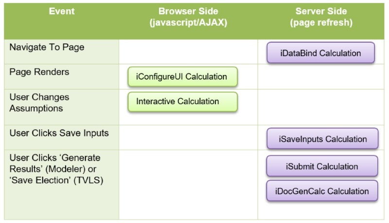

# Evolution Framework Result Builder

The Result Builder Framework (RBF) was developed to push the RBLe Framework to the next level. This framework puts almost complete control of the results into the Conduent engineers' hands by manipulating the CalcEngines (CEs) in specific ways. The vast majority of the time, no collaboration with KAT is needed to produce full featured, professional result pages for KAT/Conduent sites. The bare bones explanation of what the ResultBiuder is can be summarized by this:

> The RBF has two driving tables; `navigation` and `contents`. `navigation` controls a 'result navigation' menu, called the Results Navigator, while `contents`, as its name implies, defines the 'content' that should be associated to each navigational item. Normally, one navigation and one contents table is all that is needed for effectively rendering results on a site; however sub-navigation (requiring additional `navigation-X` and `contents-X` tables) is supported. Other than these two tables, all other tables are processed generically with specific columns and rows aiding the Conduent engineer in achieving their desired output.

## Framework Tables

In addition to `navigation` and `contents` tables, there are a handful of other tables that have special meaning and processing rules. In all other cases, table names have no bearing on the generic processing RBF applies to the results.

- variable 
- debug 
- errors 
- warnings 
- navigation 
- contents 
- highcharts 
- highcharts-overrides – global override, id = chart id, overrides any matching settings in specified option table? 
- highcharts-options-X 
- highcharts-data-X 
- help-items 
- download-package 
- docgen-table-properties 
- data-updates 
- incomplete-forms 

For additional information, please refer to the RBLe table exporting rules described in [General Tab Structure - Tab Processing Flow](CalcEngines.md#tab-processing-flow) and [RBLResult - Result Tab Flow](CalcEngines.md#result-tab-flow) that are applied to the CE before even being processed by RBF.

### navigation Table

The `navigation` table is basically the 'outline' of the result rendering. It controls which 'sections' are displayed. Each row in the `navigation` table is referred to as a 'navigational item' or more appropriately a 'section'. The following columns are applicable to this table:

Column | Description
--- | ---
`section` | This is essentially an 'id' for each section of the results. It must be numerical and go from `1..N`, with `N` being the total number of sections. 
`on` | Determines whether or not this section should be displayed. 
`label` | This will be the 'Link' text as well as the 'header' text for this section. 
`link` | If you don't want to use `label` as the hyperlinked text for navigation (helpful for subcontent navigation), you can provide text here instead. If this is left blank or not provided, then `label` is used as the hyperlink. 
`intro` | This is the text description of this section and is displayed directly below the label header in the actual content. 
`selected` | Set one section row to 1 so that RBF can set the default item to show. 

Given the columns described above, the navigation structure for every site is processed the same way:

- Only render the section if `on` column is set to `1` or not present. 
- Only show the Results Navigator if there is more than one section being exported. 
- In the Results Navigator, for each section exported 
	- Generate a link that will toggle results into view. 
	- Place a CSS class of `ResultNav` or `ResultNav-selected` appropriately based on whether or not this section is currently section being viewed (for main navigation table, simply look at the `selected` column). 
	- Use `link` or `label` as text to hyperlinked as described above. 
	- Call javascript function `SetCurrentNav(currentSectionId, sectionPrefix)` substituting `currentSectionId` and `sectionPrefix` appropriately which will first hide all sections with an `Id` starting with `sectionPrefix` then display the section with an `Id` of `currentSectionId`. 
	- If not a sub navigational structure, also call `SetResultNavClass(currentLinkId)` substituting `currentLinkId` appropriately which will set the CSS class of all links with an `Id` starting with `lnkResults` to `ResultNav` and then set the CSS class of the link with `Id` of `currentLinkId` to `ResultNav-selected`. 
- For each section exported 
	- Create a `div` (simply an HTML section) with id `divResultX` with `X` being `id`.
	- If section is 'current section' (`selected` is `1`) set the visibility to true (set `display:;`) otherwise set false (`display:none;`). 
	- Create header (`<h4>label</h4>`) 
	- For each column that starts with `intro` create a paragraph under the header (`
intro
`). 
	- Render all the content by looking at the associated 'contents table' and finding all associated content (where `content.section = navigation.section`) 
- If processing main navigation table, display 'planning links' as described by [iCalcType](CalcEngines.md#framework-inputs).

### contents Table

The `contents` table is basically the 'brains' of the result rendering. It controls what content is displayed for each navigationals section and controls how that content (tables) are rendered. The following columns are applicable to this table:

Column | Description
--- | ---
`id` | This is optional Id value that can be used in CSS processing or javascript. RBF does nothing with this value except pass it through using this value instead of a concatenated `contents_section_item` value. 
`section` | This specifies which navigation section this content row is associated to. You can also specify one or more `foot` rows/sections and it will render that content at bottom of page 'statically' (not showing or hiding based on which section you are viewing). 
`on` | Determines whether or not this content should be displayed. 
`divider` | Determines if a separator line will be rendered after this content in HTML. 
`label` | This is just a 'subheading' to place before this content. 
`text` | You can have one or more columns that start with text and they are just rendered as paragraphs before any tables or charts defined for this content row in the item column. 
`item` | This is name of 'item' (either table or chart) to render. 
`type` | This tells RBF what 'type' the item element is. The following values are valid:  - `chart` - This tells RBF to rendered the chart referenced in the item column. - `HighCharts` - This tells RBF to generate the markup for a HighChart referenced in the item column using the `HighCharts-item-Data` and `HighCharts-item-Options` tables. - `table` - This tells RBF to render the table (using the Table Export Rules described below) referenced in the item column. - `list` - This tells RBF to make a bulleted list from the table named in the item column using the column named text as each bulleted item. - `numbered` - This tells RBF to make a numbered list from the table named in the item column using the column named text as each bulleted item. - `p` - This tells RBF to ignore the item column since all needed paragraphs were rendered via columns starting with text. - `subcontent` - When using subcontent type, item links to 'sub' navigation table and a sub Results Navigator is built off this navigation table and the corresponding contents table. The names must have the same suffix (i.e. navigation-1 works with contents-1). - `template` - Use this when you need to render something complex that the RBF doesn't support natively. You will work in coordination with KAT, but item will be a name of a 'rendering template' and it can basically render information in any form you desire. In most cases, this type shouldn't be required. - `dyk` - This tells RBF to create a DYK call out box. The label property is the header (Did You Know? by default), and every column starting with text is rendered in a separate 
 element. DYK element rows should appear directly below the content row you want to 'link' it with. 
`class` | This tells RBF what CSS class to apply to the current table being rendered. `class` can only be used on items of `type = 'table'` and usually you will have to coordinate with KAT on which class to use. class is a way to control the appearance of a table on the web page. 
`note` | You can have one or more columns that start with note and they are just rendered as paragraphs after any tables or charts defined for this content row in the item column. 

Given the columns described above, the content rendering for every site is processed the same way:

- Only render the content if the `on` column is `1`. 
- Create a `span` (simply an HTML section) with a unique id (either using the id column from table or a unique combination of `[content table name]_[section column]_[item column]`. 
- If `label` value is present, create bold a paragraph to represent a sub header (`
label
`). 
- Create an HTML table that dynamically adjusts the content column width via CSS classes `dyk-main-content` and `no-dyk` based on whether or not the next content row in this table has a `type` of `dyk`. If next content row `type` is `dyk` then this table should have two cells where the left cell contains the content from the `item` column and the right cell contains the `dyk` from the following `content` row. 
- For each column that starts with `text` if there is content in the column create a paragraph for it (`
text
`). 
- If `type = table`, process the table referenced in the `item` column using Table Export Rules. If class is present, pass that as table class name otherwise use dataview1. 
- If `type = list` or `type = numbered`, process the table referenced in the `item` column and create a `<UL>` (bullet list) or `<OL>` (numbered list) list appropriately and using the `text` column for each bulleted/numbered item's display value. 
- If `type = template` call the overridden `ClientTemplate` and provide custom HTML with guideance from Conduent. (i.e. they want to put two charts side by side instead of stacked). 
	- If `label` is not blank, use that as the header otherwise use `Did You Know?` by default. 
	- For each column that starts with `text`, render the content in a separate `
` element. 
	- Recursively create any additional DYK boxes for `content` rows of `type = dyk` that occur in succession. 
- If type = 'subcontent', then item points to another 'navigation table'. Basically the same flow as described in the `navigation` Table section is used with the following changes. 
	- Create a sub Results Navigator in each navigational section rendered. I can't only have one sub navigator because of the positioning of the sub Results Navigator in the sections. It would be hidden when looking at different sections, so I create a 'static' navigator in each section in the 'same place' so it looks like the same navigator. 
	- Instead of looking for a linked table named `contents` it looks for a table suffixed with same suffix from `navigation` name (i.e. `item=navigation-1` would work with `contents-1` only). 
- For each column that starts with `note` if there is content in the column create a paragraph for it (`
note
`). 

## RBF Table Export Rules

All other tables rendered by RBF, run though the generic rules described in this section. The only table that has any special processing is the MHA `option` table (a table named `option` and being ran from an MHA calculation request). Simply put, if not an MHA `option` table, only columns starting with `text` or `value` are rendered; however for the MHA `option` table, all columns are rendered (excluding 'special' columns described below).

The following columns are applicable to all tables processed by RBF Table Export Rules:

Column | Description
--- | ---
`id` | Any unique Id assigned to the row. Not really processed unless a special row Id described below. 
`on` | Whether or not this row gets exported. 
`code` | Other than 'header codes', this is simply an additional grouping that can be applied via arbitrary codes that mean a specific function based on client result rendering.  `h`, `hdr`, `header`: If `code` is any of these (or starts with `hdr` or `header`), make this row a header row (HTML `th` element).  Note, it also looks at the `id` column and if `id` is any of these values the same rules apply.  Numeric Value: In coordination with KAT, a numerical code 'grouping' can be used to group items together. This is useful if we render half this table one way and half another way, you could use codes `1` and `2` to group rows.
`class` | Optional CSS class tag to include on the table row. It will be applied to the corresponding HTML tr element for this row. 
`span` | Optional column to use to tell RBF how to 'span' columns in current row (it is not processed for MHA option table).  The format is: `columnName:spanCount[:columnName:spanCount]`  Where you specify the column name followed by a colon and how many columns to span. If you need to control more than one grouping of spaning, you can put as many definitions back to back separated by colons as needed.  Examples:  Span `text1` all three columns in a three cell table: `text1:3` Span `text1` 1 column and `value1` 2 columns in a three cell table: `text1:1:value1:2`  **Note**: When using the `span` column, the total number of columns spanned/configured must equal the total number of columns in the table even if the span configuration directs several columns to 'span' only one column (which is counter intuitive since that really isn't 'spanning').  Example:  If you have table with columns `text1`, `value1`, `value2`, and `value3` and you want `text1` to span the first two columns and then `value2` and `value3` render their contents appropriately, the following applies to the span column:  **Wrong**: `text1:2` - setting this will only generate one cell spanning two columns, but leaving the third and fourth columns unrendered. **Correct**: `text1:2:value2:1:value3:1` - you must explicitly set all columns for the row. The sum of columns by this configuration is four which equals the total number of columns in the table.
`textX` | Start any column header with `text` and the content will be left aligned automatically. 
`valueX` | Start any column header with `value` and the content will be right aligned automatically. 

* Only columns that start with `text` and `value` are rendered (Excluding the MHA `option` table described below).
** All other columns are ignored (Excluding the MHA `option` table described below).

### HTML Markup Support

If the result is going to be displayed on a web page, you can embed HTML by doubling up `<< >>text<</ >>` (i.e. `<<b>>this would be bold<</b>>`).

Common HTML element names `<<b>>bold<</b>>`, `<<u>>underline<</u>>`, `<<i>>italic<</i>>`, `< >` line break, `<>Red<>`

### option Table

The following columns are applicable to MHA `option` table processed by Table Export Rules:

Column | Description
--- | ---
`text` | This column is left aligned by default (unless class `row` is configured for this column). If `code` is `h`, then this column is spanned across the entire row. 
`desc` | This column is left aligned by default (unless class `row` is configured for this column). 
`screen` | Whether or not this row gets rendered on the screen. Some of the option rows are only used to display on the downloaded benefit package. 
`factor`, `amount`, `ben-amount`, and `rel-value` | If all these columns are blank (or not provided) then text should be spanned across the entire row. 

The `span` column is not processed in MHA `option` tables.

All other columns that do not contain `text` or `desc` in their name are right aligned by default (unless class `row` is configured for column).

All columns in the MHA `option` table are **rendered**.

The following *row Ids* are applicable to Table Export Rules:

ID | Description
--- | ---
`on` | Similar to the 'On Column', you can use an 'On Row' to programatically control which columns are displayed. All columns with a `1` in the 'On Row' will be displayed, columns with a `0` will not be displayed. 
`class` | This row is optional, but if you want to control the look of a column with a CSS class, you can specify the class here. Using the `class` row will probably involve coordination with KAT. 
`width` | If you want to have complete control over the widths of the columns you can use a 'width row' and assign a numeric value for each column. By default the entire table can not span more than `610`. 

Given the columns and rows described above, the Table Export rules for every site is processed the same way:

- If no data was exported, then a message will be displayed stating that No `[table name]` data exists in this calculation. 
- Apply the `class` element (if supplied) from the `contents` row for this table otherwise default to `dataview1` (note MHA calculations are always `dataview1`). 
- If 'width row' is present, create a hidden table row via HTML CSS class `hiddenRow` assigning specific widths to each column, otherwise set column widths to automatically scale on the page. 
	- Default - Process all columns that start with `text` or `value`. 
	- MHA option - Process all columns except 'special columns' 
- If the current row is a drill down parent row, then render all drill down child rows required for desired functionality defaulting visibility to off. 
- Apply value of `class` column to the `<tr/>` if it is supplied. Note that if the row being processed is a drill down 'child row', then `drilldown-row-` will be prepended to the class value supplied in the CE. 
- If `code` or `id` column is `h`, starts with `hdr`, or starts with `header`, create a header row by putting values in a `<th/>` element instead of a `<td/>` element. All columns are vertically aligned to the bottom in header cells. 
	- Default 
		- If there is only one `text` or `value` column that has a value and all other columns are blank, make that column span across the entire row. 
		- If `span` is specified, then render the columns appropriately based on the span configuration. 
		- If `span` is not specified, then render all columns that start with `text` or `value` in a header cell. 
		- If 'class row' is specified and configured for the column being processed, add CSS class attribute to the header cell. 
		- Search any rendered content for embedded help items. 
	- MHA `option` table 
		- If `code` is `h`, span the `text` column across the entire row. 
		- If `code` is not `h`, render every column in a header cell. 
		- `class row` and span configurations are *not* processed. 
- If `code` or `id` does not indicate a header row, then render a data row. 
	- Default 
		- If 'class row' is specified and configured for the column being processed, add CSS class attribute to the data cell and do not specifically set left and right alignments. 
		- If the column name starts with `text` left align the cell contents. 
		- If the column name starts with `value` right align the cell contents. 
		- If `span` is specified, then render the columns appropriately based on the span configuration. 
		- If `span` is not specified, then render all columns that start with `text` or `value` in a data cell. 
		- Processing drill down functionality 
			- If column is the hyperlinked column and the drill down type is `column`, only render the column if on the first row (it will be row spanned for all child rows so can't render subsequent rows). 
			- Create hyperlinked content to toggle parent and child rows appropriately via javascript. 
		- Search any rendered content for embedded help items (excluding hyperlinked drill down columns). 
	- MHA `option` table 
		- If `desc`, `factor`, `amount`, `ben-amount`, and `rel-value` are blank, span the `text` column across the entire row. 
		- If the name of the column does not contain `text` or `desc`, then right align the cell. 
		- span configurations and `drilldown`, are *not* processed. 

### Drill Down Functionality

Drill down functionality allows the CalcEngine to build a result table that supports clicking a link in the table to 'drill down' into more detail.

The sample below shows 401k plan projections based on the participant's current balance and the future contribution rate and rate of return entered by the user. The projected account balance is shown in total and separately by current balance, future employee contributions and future company matching contribution. It also shows an example of creating a table that will allow the user to click on a cell to 'drill down' into a more detailed view. 

To support drilldown capability, you must provide a column named `drilldown` along with a row where the `id` is set to drilldown. Once this row and column are provided, the following is only applicable to a 'drill down' table.

#### drilldown Row

Use this row to specify which column is hyperlinked as the drill down column as well as specifying what type of 'drill down' is supported by this column. 

- To specify which column should be the hyperlinked column, put the word `link` in the column you wish to specify.  If you don't supply a link value it will use the first rendered column.
- To specify which type of 'drill down' to use, you should put `row` or `column` in the `drilldown` column of the drilldown row. 

##### drilldown row Type

`row` (default if not supplied): The actual row that is the 'parent' is displayed in either state - collapsed or expanded - and is used for 'hide/show' capability of the 'additional' data.

**Collapsed**
Source | Pre-Tax | Post-Tax
--- | --- | ---
[Pension Plan](#drill-sample) | 55,591 | 47,365 
Savings - Current Balance | 0 | 0 
Social Security | 21,600 | 21,600 

**Expanded**
Source | Pre-Tax | Post-Tax
--- | --- | ---
[Pension Plan](#drill-sample) | 55,591 | 47,365 
*Savings - Future Company Match* | *0* | *12,617* 
*Savings- Future Colleague Contributions* | *7,570* | *7,570* 
*Savings - Total Future Balance* | *7,570* | *20,187* 
Savings - Current Balance | 0 | 0 
Social Security | 21,600 | 21,600 

##### drilldown column Type

`column`: The link column is spanned across every row when the 'drill down' information is expanded. When collapsed, the 'parent' row should be a summary of all the detailed information. When expanded, the 'summary row' is hidden (toggled) and only sub rows are displayed (with the link column spanned over all rows).

**Collapsed**
Age | Source | Legacy Retirement Program | New Pension and Savings Program
--- | --- | --- | ---
[55](#drill-sample) | Total Pension + Savings | 55,591 | 47,365 
[56](#drill-sample) | Total Pension + Savings | 54,322 | 41,275 
[57](#drill-sample) | Total Pension + Savings | 53,100 | 36,666 

**Expanded**
Age | Source | Legacy Retirement Program | New Pension and Savings Program
--- | --- | --- | ---
[55](#drill-sample) | Total Pension + Savings | 55,591 | 47,365 
[56](#drill-sample) | *Pension Plan* | *14,322* | *7,275* 
| | *Savings - Current Balance* | *15,000* | *12,000* 
| | *Savings - Future Company Match* | *15,000* | *11,000* 
| | *Savings - Future Colleague Contributions* | *10,000* | *11,000*
| | *Total Pension + Savings* | *54,322* | *41,275*
[57](#drill-sample) | Total Pension + Savings | 53,100 | 36,666 

#### drilldown Column

Use this column link up each 'sub row' to the 'parent row' by using the value from the parent's id column.

### help-items Table

This templated table is a 'special' processing table. You can dynamically inject pop up help tooltips in calculation results by leveraging this table. You specify a help item with each row in this table that you can then reference anywhere in your results by placing the following syntax:

`{btr:helpitem id="help1"/}`

In the above example, if you had a help item with an `id` of `help1`, the appropriate tooltip would be generated based on that row in the `help-items` table. The following columns are only applicable to the `help-items` table:

Column | Description
--- | ---
`id` | required; You use this value as a 'reference' when providing the `btr:helpitem` syntax in your results. 
`class` | optional; If you want to change the default look/feel of the help tip, you could provide your own class and coordinate with BTR to change the display style of the help tip. 
`width` | optional; You can control the width of the help tip if needed by providing a numeric value here to represent the width in pixels. 
`display` | required; The word or phrase that is rendered on the screen hyperlinked as a help tip. 
`title` | required; The title that displays inside the popup box. This usually 'matches' the display with the possible exception of capitalization. 
`help` | required; The text or HTML displayed inside the popup box. 
`tooltip` | optional; The text that is displayed when you hover over the hyperlinked word (the display column).

### variable Table

A table of simply id/value pairs.

You can add as many variables variables as needed, but in general, do not add any values to this tab that are not used/displayed after a calculation is ran. Create a worker tab or at least tables that aren't stored in the database on this tab, and put all helper values there.

The variable table should only have two columns a majority of the time: `id` and `value`. Optionally, you can supply an `on` column to control which variables are exported. There are a couple of default ‘variables’ that should always be included on modeling result pages:

ID | Description
--- | ---
`job-token` | This is simply duplicating the `iJobToken` input so that the RBLe Framework can use this to ensure that the results coming back are the proper results for the current participant. If the value in the result page does not match the value on the input page, then some bug has occurred and the 'result page calculation/refresh' did not occur and the results on the page are probably from a previous particiant's calculation – which is incorrect. 
`iCalcType` | This is simply duplicating the `iCalcType` input so that it can be used in the generic result rendering code. This value is used to dynamically change the title of the results to 'Estiamte Results', 'Total Retirement Income', or 'Planning Results' for values `1`, `2`, and `3` respectively. Additionally, links inside the 'navigation section' of the results are toggled based on this variable. The 'Are you saving enough for Retirement?' Link if the value is `2` and there is *not* an `iPlanningOn` variable present. Finally, if the value is `3` then 'planning results' are displayed, so an additional 'Click here to recalculate Total Retirement' link is generated. 
`iPlanningOn` | When `iCalcType` is 2 (Total Retirement), this variable is used to control whether or not to display the 'Are you saving enough for Retirement?' Link (i.e. probably turn off if current age is over 70). Set the value to `1` to display the link and set it to `0` to not show the link. 

Optionally, you can have a `valuePastCalcs` column. This provides a way to specify a different output to display if the user is viewing a previously completed calculation (usually used to disable/remove references to toggling/providing inputs). 

## Page Lifecycle

Click one of the links in the following list to see detailed help about the function.

Calculation | Description
--- | ---
[iDataBind](#idatabind-calculation) | The `iDataBind` calculation occurs only once when a page is requested. The primary purpose of this calculation is to 'data bind' input values and data sources for 'list controls'. List controls are either drop down controls or radio button groups. 
[iConfigureUI](#iconfigureui-calculation) | The `iConfigureUI` calculation occurs only once when a page is rendered. The primary purpose of this calculation is to set the initial state of the UI (i.e. labels, help text, visibility, enabled state, etc.). 
[Interactive](#interactive-calculation) | The Interactive Calculation occurs every time the user changes an input on the screen. In a few other situations (coordinated with KAT) an Interactive Calculation is occurring when it would seem an [iSubmit Calculation](#isubmit-calculation) would be appropriate. An example of this is on multi-step or wizard type interfaces (i.e. TVLS election sites), where the user clicks a 'button' that moves on to the next step. Until the final step is completed when data would be saved (on an iSubmit Calculation) it is actually just an Interactive Calculation that is controlling the visibility state of the different steps. 
[iSaveInputs](#isaveinputs-calculation) | The `iSaveInputs` Calculation present on interactive modelers occurs when the user click the 'Save Inputs' button on the UI. All inputs on the page will be passed back to the CE and it is the CE developer's responsibility to save all the values the appropriate location. 
[iSubmit](#isubmit-calculation) | The `iSubmit` Calculation is used to either save data on an election site or perform the calculation on non-interactive sites. 
[iDocGen](#idocgen-calculation) | The `iDocGen` Calculation is used in election sites. If the [iSubmit Calculation](#isubmit-calculation) completes successfully, the `iDocGen` calculation runs to generate the FolderItem used as the data source for confirmation downloads. 

### iDataBind Calculation

The `iDataBind` calculation occurs only once when a page is requested. The primary purpose of this calculation is to 'data bind' input values and data sources for 'list controls'. List controls are either drop down controls or radio button groups.

The only input provided to this calculation is `iDataBind=1`.

CalcEngine tables processed: `ejs-defaults` and `ejs-listcontrol`.

#### ejs-defaults

This table allows the CE developer to set default values for all the inputs before the page is rendered.

If the control the CE is setting to default for is a checkbox list, instead of setting the default value to `1` or `0` (as most checkboxes are) you return a `,` delimitted list that correspond with the `key` column from the checkbox list's underlying `ejs-listcontrol` data table.

**Note**: `ejs-default` rows are normally only returned during the `iDataBind` Calculation, but can be processed during an [Interactive Calculation](#interactive-calculation) as well if changing one input should update the value of another input.

Column | Description
--- | ---
`id` | The name of the input on your input page (i.e. `iDateTerm`). 
`value` | The value to set as the default. If `id` points to a list control, you should return the data value of the list item instead of the display text. 
`on` | Whether or not to return this row. 

#### ejs-listcontrol

This table allows the CE developer to provide the list items (value and display) for a drop down control or radio button list. This is accomplished by returning list of control names and the associated table name that contains the data (see ejs-listcontrol Data Source).

**Note**: This table should set formula for the on column in all rows to `=iDataBind=1`.

Column | Description
--- | ---
`id` | The name of the input on your input page (i.e. `iMaritalStatus`). 
`table` | The name of the table that provides the list items for the control specified by `id`. 
`on` | Whether or not to return this row. 

#### ejs-listcontrol Data Source 

These tables can be named anything and are linked to a list control input via the `ejs-listcontrol` table. Columns in data source tables, however, must be of the format described below.

**Note**: This table should normally set formula for the on column in all rows to `=iDataBind=1`.

Column | Description
--- | ---
`key` | The data value for current list item (i.e. `MN` for Minnesota). 
`text` | The display text for the current list item. 
`on` | Whether or not to return this row. 

### iConfigureUI Calculation

The `iConfigureUI` calculation occurs only once when a page is rendered. The primary purpose of this calculation is to set the initial state of the UI (i.e. labels, help text, visibility, enabled state, etc.).

In addition to the `iConfigureUI=1` input, all input values, including those set during the `iDataBind` Calculation, will be passed as well.

CalcEngine tables processed: `ejs-output`, `ejs-visiblity`, `ejs-disabled`, `ejs-sliders`, and `skip-RBLe`.

#### ejs-output

This table allows the CE developer to set any display values on the UI (i.e. labels, help, etc.) The standard convention for `ejs-output` IDs given `{id}` is the name of the input on the input tab (i.e. `iDateTerm`):

- `l{id}` – The input label. 
- `h{id}` – The help text for the input. 
- `h{id}Title` – The title displayed in help popup. 

All `ejs-ouput` IDs are found in the `class` attribute of the associated HTML element when inspecting the page source.

**Note**: The `ejs-output` table is processed in both the `iConfigureUI` Calculation and the [Interactive Calculation](#interactive-calculation), however, if any `ejs-output` rows do not dynamically change based on UI inputs, the `on` column should be set to `iConfigureUI=1`. If the `value` column changes based on the input state of the UI, then the row should always be returned.

Column | Description
--- | ---
`id` | The ID of the `ejs-visiblity` element on the page (i.e. `viDateTerm`). 
`value` | `1` to show the element, `0` to hide the element. 
`on` | Whether or not to return this row. **Note**: Setting this to `0` does not hide the associated element. 

#### ejs-visiblity

This table allows the CE developer to show and hide elements in the UI. This can simply be an input, or an entire 'section'. A section `ejs-visibility` ID would be coordinated with KAT and place in the class attribute of the HTML element. The standard convention for `ejs-output` IDs given `{id}` is the name of the input on the input tab (i.e. `iDateTerm`):

`v{id}` – The visibility of the input. 
`vh{id}` – The visibility of the help popup icon (essentially turning on or off the help). 

**Note**: The `ejs-visibility` table is processed in both the `iConfigureUI` Calculation and the [Interactive Calculation](#interactive-calculation), however, if any `ejs-visibility` rows do not dynamically change based on UI inputs, the `on` column should be set to `iConfigureUI=1`. If the `value` column changes based on the input state of the UI, then the row should always be returned.

Column | Description
--- | ---
`id` | The ID of the `ejs-visiblity` element on the page (i.e. `viDateTerm`). 
`value` | `1` to show the element, `0` to hide the element. 
`on` | Whether or not to return this row. **Note**: Setting this to `0` does not hide the associated element. 

#### ejs-disabled

This table allows the CE developer to enable and disable inputs in the UI.

**Note**: The `ejs-disabled` table is processed in both the `iConfigureUI` Calculation and the [Interactive Calculation](#interactive-calculation), however, if any `ejs-disabled` rows do not dynamically change based on UI inputs, the `on` column should be set to `iConfigureUI=1`. If the `value` column changes based on the input state of the UI, then the row should always be returned.

Column | Description
--- | ---
`id` | The id of the input to enable or disable (i.e. `iDateTerm`). 
`value` | `1` to disable the input, `0` to leave the input enabled. 
`on` | Whether or not to return this row. 

#### ejs-sliders

This table allows the CE developer to configure the state (min, max, etc.) of the input sliders found on the page.

**Note**: This table should set formula for the on column in all rows to `=iConfigureUI=1`.

Column | Description
--- | ---
`id` | The id of the input to configure as a slider. 
`min` | Numeric value specifying the minimum allowed slider value. 
`max` | Numeric value specifying the maximum allowed slider value. 
`step` | Numeric value specifying the slider increment. 
`format` | String indicating type of number slider represents. `n` for number; `p` for percent. 
`decimals` | The number of decimal places to show on the formatted value. 
`on` | Whether or not to return this row. 

#### skip-RBLe

This table allows the CalcEngine developer to indicate that an input should not trigger an [Interactive Calculation](#interactive-calculation) when the value changes.

**Notes**
- By default, every input on a page is hooked up to trigger a calculation when its value changes. But in some cases (i.e. TVLS Election) there are many controls that will not require a calculation to be triggered. Interactive Calculations enable a page to either update results, perform validations on inputs, or update state (visibility/disabled) every time an input changes value. However, inputs on election sites that simply gather information (i.e. address information) have no effect on the current page state. To improve user experience, and eliminate the slight delay caused by each calculation, CE devleopers should flag all such inputs via the `skip-RBLe` table. 
- This table should set formula for the on column in all rows to `=iConfigureUI=1`. 

Column | Description
--- | ---
`id` | The input id to flag as not requiring an *Interactive Calculation*. 
`on` | Whether or not to return this row. 

### Interactive Calculation

The Interactive Calculation occurs every time the user changes an input on the screen. In a few other situations (coordinated with KAT) an Interactive Calculation is occurring when it would seem an iSubmit Calculation would be appropriate. An example of this is on multi-step or wizard type interfaces (i.e. TVLS election sites), where the user clicks a 'button' that moves on to the next step. Until the final step is completed when data would be saved (on an iSubmit Calculation) it is actually just an Interactive Calculation that is controlling the visibility state of the different steps.

CalcEngine tables processed: [`ejs-defaults`](#ejs-defaults), [`ejs-output`](#ejs-output), [`ejs-visiblity`](#ejs-visiblity), [`ejs-disabled`](#ejs-disabled), and `error`.

#### error

This table allows the CE developer to flag inputs as failing validation and in addition to showing the error in the validation summary, with the right values in the table the input can be highlight as containing an error.

**Notes**
- The responsibility of validating inputs in RBL UI Builder has been transferred from KAT developers to CE developers. This keeps the validation logic in the hands of the developers that actually know all the rules. 
- Using this table in the [iSubmit Calculation](#isubmit-calculation) is more common than using it during the Interactive Calculation, but either are supported. The main type of site that uses this during an Interactive Calculation is a multi-step/wizard based UI when you are progressing through steps. Validation is done each time the user attempts to move from one step to the next. If this is not the type of site being developed, this table could set the formula for the `on` column in all rows to `=iSubmit=1`. 
- Make sure to review the helper Validation Functions provided by RBLe. 

Column | Description
--- | ---
`id` | The input id to flag as failing validation. If the id does not match any input on the UI, the error message will still appear in the validation summary, but no input error highlighting will occur. 
`text` | The text to display for the error message. 
`on` | Whether or not to return this row. 

### iSaveInputs Calculation

The `iSaveInputs` Calculation present on interactive modelers occurs when the user click the 'Save Inputs' button on the UI. All inputs on the page will be passed back to the CE and it is the CE developer's responsibility to save all the values the appropriate location.

If the site allows only one set of saved inputs, saving values to a section in the xDS flat data would be appropriate. Then during the [iDataBind Calculation](#idatabind-calculation) the CE developer could simply use those saved values in the `ejs-defaults` table (falling back to other data values or hard coded defaults if not present).

If the site allows the user to save several scenarios of inputs, then obviously, each scenario would have to be saved to an xDS history row. Then, during the iDataBind Calculation, a history index would be passed back to the CalcEngine to indicate which set of inputs to use as defaults.

CalcEngine tables processed: [`error`](#error) and `data-updates`.

#### data-updates

This table allows the CalcEngine developer to provide update instructions to be applied to the current participant's xDS data. Flat or history data can be updated and/or deleted.

**Notes**

- If any rows in the `error` table are returned, updates will not be applied. 
- No validation will be done to the data returned from the CalcEngine. It is up to the CalcEngine developer to ensure valid data is returned, including no partial history rows (i.e. not providing required fields a row that is being created). 
- The rows in this table should set formula for the `on` column in all rows to `1` only when either `iSaveInputs=1` or `iSubmit=1` (on election sites). 

Column | Description
--- | ---
`field` | The name of the xDS field to apply change to. 
`type` | If the field is part of a history table provide this xDS history table type. 
`index` | If `type` is provided, you must also provide the xDS history table index. 
`value` | The value to apply to xDS data. If this value is blank, the data will be deleted from xDS. 
`on` | Whether or not to return this row. 

### iSubmit Calculation

The `iSubmit` Calculation is used to either save data on an election site or perform the calculation on non-interactive sites.

For non-interactive sites, the only table processed will be `error` and if none are present, the results of the calculation will be passed to RBF. For election sites, in addition to the `error` table, the `data-updates` table will also be processed.

In addition to all the inputs on the page being passed to the CalcEngine, the `iSubmit=1` will be passed as well.

CalcEngine tables processed: [`error`](#error) and [`data-updates`](#data-updates).

### iDocGen Calculation

The `iDocGen` Calculation is used in election sites. If the [iSubmit Calculation](#isubmit-calculation) completes successfully, the `iDocGen` calculation runs to generate the FolderItem used as the data source for confirmation downloads.

This input was introduced to aid CalcEngines that had both calculation results and DocGen results on one tab. The `iDocGen=1` input would help them toggle sheet type from ResultXml (used during the election) to FolderItem (used during `iDocGen` Calculation). Moving forward, it is recommended that the DocGen FolderItem creation be placed on a completely separate tab. In this scenario, `iDocGen=1` input is not even needed since the tab has a singular focus. However, for older sites, or should the CalcEngine developer choose to use only one tab, the feature and input will continue to be supported.

During this calculation, the only input being passed to the CalcEngine is the `iDocGen=1` input.

[Back to RBLe Framework](RBLe.md)