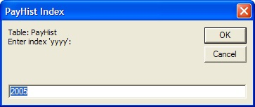
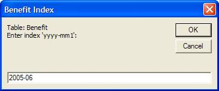

# KAT Tools Excel Add-in

KAT has developed an Excel add-in (KAT.Extensibility.Excel.xll) to help KAT developers in many of the day to day tasks when creating Employee Self Service or Administration websites in the Evolution and/or Camelot frameworks. The add-in's functionality has now expanded to cover all areas of CalcEngine management, Specification Sheet management, export data into a format that can be consumed by KAT's XML Data Service (xDS), as well as general purpose Excel spreadsheet helpers.

The original documentation (and it will continue to be updated) was leveraging 'comments' on Excel cells of the add in. However, this required a user to know which cells to examine, along with not allowing the user to do an easy search of the entire set of documentation. Although it would be beneficial to read all the documentation for RBLe Framework in its entirety, time permitting, KAT intended this document to be an online searchable document so that when questions arise about specific functionality in regards to CEs, Spec Sheets, and/or exporting data the user can search this document instead of being forced to find the 'hidden' comment on an Excel cell.

## Exporting Data for xDS Framework

All data for KAT employee self service and administration systems is stored in KAT's Xml Data Service (xDS) which has two types of data, Profile data and Historical data. Profile data is flat data such as name, date of birth, etc. Historical data is tabular/repeating data. For example, pay history is often stored in a table indexed by year. Cash balance information is often stored in a table indexed by year-month (`yyyy-mm`).

KAT has implemented a data export process that is completely driven by the column names of the data. The general concept is that a "column name" controls how data is loaded into xDS. This eliminates custom export code that is often created and managed behind the scenes and required careful coordination/testing for each client.

### Benefits of Column Heading Specifications

1. No custom data loads (removes more configuration set up for both Conduent and KAT) 
1. Using shared/tested code in all cases instead of custom code for each client 
1. Conduent controls more of setup and doesn't need to request and test special handing or code changes 
1. Specification Sheets are simplified by removing the Data Load tab and reducing redundant configuration settings. 
1. 'Multiple Updates' could be done within Excel (which is easier for Conduent actuaries to verify and produce) then exported and uploaded to site without any intervention from KAT 
1. Column headings are self documenting, with any rules being applied directly available to Conduent actuaries. 

### Column Name Custom Flags

Another source of custom coding is special treatment of certain fields. This new standard supports several flags that may be used to specify special handling. You may append one or more of the following flags to the field name in order to indicate special handling:

Flag | Description | Sample
---|---|---
`/format:fmtstring` | This flag will format the data using the *fmtstring* to indicate the proper format. This is commonly used to indicate decimals when the source data may have more decimal than wanted. Also, if you want to zero pad an id number. (Note that ssn is 9 digit, zero padded by default) | To format cash balance to nearest cent: `amt-cb/format:0.00`  To zero pad employee id to eight characters: `id-employee/format:00000000`
`dateconvert:yyyymmdd` | If the date is entered as a 'real' date (mm/dd/yyyy), export works properly. Sometimes data is not in this format, i.e. the slashes may be omitted. This flag will convert a column to a valid date when the original data not necessarily recognized as a date. For example the data is "03011999" can be exported as a date using this flag to specify the date format. Currently supported are the following values for the flag: `yyyymmdd` or `mmddyyyy` | To convert a date-birth field from `19730509` value use `date-birth/dateconvert:yyyymmdd`.  The value will be exported as `5/9/1973`. 
`/numberconvert:Dn` | Use this flag if numeric data, with no decimals, needs to be converted to decimal numbers. For example, if `17325` is really `173.25`, this flag can be used to do the conversion during data export. `n` is the number of decimals, in this case, `D2`. | To convert a svc-cred field from 15825 to 15.825 use `svc-cred/numberconvert:D3`. The value `15825` will be exported as `15.825`. 
`/key` | By default, any field named 'ssn' will be the key field for the participant that is used by the database. If you want to use a different field, you use the `/key` flag. | To specify employee id as the key value use `id-employee/key`.
`/new-index` | This flag will tell the system that during a Row Based export, you want to update the current index (provided by the index column) to the one specified in this column.| `newIndex/new-index`
`/noreplace` | This flag will tell the system that if there is existing data in the xDS database, **DO NOT** replace it with the new data. | Assuming that xDS addresses are better than addresses coming from data feed, you do not want to overwrite the xDS addresses use `address/noreplace`.
`/delete` | This flag is used to delete data for any participant who has the value 1 in a column containing this flag. This flag works at three levels, a field level, a History table row, or an entire History table. | To delete a field called comment2: `comment2/noreplace`  To delete all 2005 data from the PayHist table: `[PayHist:2005]/delete`  To delete the entire PayHist table: `[PayHist]/delete`  To delete the entire Profile (flat/history): `[Profile]/delete`  * Remember, the delete is only applied to records with a value of `1` in the data column using the delete flag.
`/deleteIfBlank` | This flag is used to delete data in the existing xDS data source if the value from the Excel Export is blank. Can only be applied to fields (and not the 'index' field of a historical table). | To delete existing address2 values if the address2 column is blank in the Excel data file, change the header to `address2/deleteIfBlank`.
`/off` | This flag is used to indicate that the column should not be exported. | To skip exporting a notes-temp field use `notes-temp/off`.
`/export` | This flag controls if a history row is added to the database. You create a column called `[Table:Row]/export`. Then, the row is only added if this column has a value of `1`. | If you have data you don't want to load, for example, pay rows with zeros, you can toggle this flag, depending on whether the pay is non-zero.  To suppress loading a row with zero pay, create a column called: `[Pay:2005]/export`  To suppress loading an entire profile and all related data, create a column called: `[Profile]/export`  This table row will only be added if the record has a value of `1` for this column.
`/default:value` | Use this flag to specify a default `value` if the cell is blank. | To specify that all records with a blank sex column should be male, you would set up the column name as `sex/default:M`.
`/text` | Use this flag to specify that the value should not be parsed as date or number. Just take the literal value in the cell. Note that `/text` supercedes `/format`. |
`/upper` | Use this flag to specify that the value should be upper cased. Note that `/upper` format is applied after the `/format` flag if it is present. |
`/lower` | Use this flag to specify that the value should be lower cased. Note that `/lower` format is applied after the `/format` flag if it is present. |
`/ignoreZero` | Use this flag to skip exporting any value if the Excel cell value is `0`. This helps in reducing the size of the export as well as having non-meaningful data rows for a participant if the data export file simply defaulting all values to 0 before processing begins. |

Note that these flag may be combined and applied to both profile and history columns. Note that some flags are incompatible with other flags. For example, `/off` and `/key` would not make sense if applied to same data column.

#### Column name examples using flags:

`id-ee/key/format:000000` means that id-ee is the key field and that it should be zero padded to 6 digits.

`[PayHist:2005]pay-base/format:0.00` applies cents formatting to a history table field.

### xDS Field Mappings

To load data into xDS, you simply have to manage the "field names" (column headers) in your Excel Spreadsheet.

Mapping Type | Description
---|---
[Profile Fields](#profile-fields) | To import profile fields into xDS, you simply name the field the same as the name of the data field in xDS (see xDS spec TODO: Do I have a link for this?). 
Historical Data Tables | To load data into historical data tables such as annual pay table or monthly balance updates, the column name will specify the table name and the index. 
Profile Notes | The final data load feature that can be used is the specially named field starting with `ProfileNotes`. 

**Note**: KAT recommends using all lower case letters in your field names and seperating the words with `-` characters. Additionally, all 'date' fields should start with `date-`.

#### Profile Fields

To import profile fields into xDS, you simply name the field the same as the name of the data field provided in xDS Specification Sheet.

Data | xDS Field | Column Header
---|---|---
Social Security Number | ssn | `ssn `
Last Name | name-last | `name-last`
Birth Date | date-birth | `date-birth`

#### Historical Data Tables

To load data into historical data tables such as annual pay table or monthly balance updates, the column name will specify the table name, index, and field name. To load data into a particular table row, the syntax for the column header is:

`[TableName:Index]fieldname`

Data | xDS Table | xDS Row Index | xDS Field | Column Header
---|---|---|---|---
2005 Annual Pay | PayHist | 2005 | pay-base | `[PayHist:2005]pay-base`
2005 Bonus Pay | PayHist | 2005 | pay-bonus | `[PayHist:2005]pay-bonus`
2004 Annual Pay | PayHist | 2004 | pay-base | `[PayHist:2004]pay-base`
June 2005 Cash Balance | Benefit | 2005-06 | amt-cashbal | `[Benefit:2005-06]amt-cashbal`
June 2005 Pay Credit | Benefit | 2005-06 | amt-paycred | `[Benefit:2005-06]amt-paycred`

##### Index Substitution

The XML export feature in Excel has been enhanced to support a wildcard for the index. Using a wildcard, you do not have to edit the column headers each time you want to load data into a different index. For example, suppose you are loading monthly cash balance amounts. Without wildcards, you would have to edit the column headers each month before loading the data in order to have it go into the proper History row. However, using wildcard index values, you can have permanent column headers and you will be prompted for the index when you export from Excel.

The syntax for using a wildcard index is to enclose the index in curly brackets:

Regular syntax: `[PayHist:2005]pay-bonus`

Substitution syntax: `[PayHist:{yyyy}]pay-bonus`

You will then be prompted for the index `yyyy`. The text inside the curly brackets can be any string placeholder (no spaces). As a best practice, you may want to use a name that reminds you of the index form.

For example when loading July 2005 data, if you have a wildcard index of: `{yyyy-mm}`. It would mean you enter an index of: `2005-07` when prompted.

Data | xDS Table | xDS Row Index | xDS Field | Column Header
---|---|---|---|---
2005 Annual Pay | PayHist | `{yyyy}` | pay-base | `[PayHist:{yyyy}]pay-base`
2005 Bonus Pay | PayHist | `{yyyy}` | pay-bonus | `[PayHist:{yyyy}]pay-bonus`
June 2005 Cash Balance | Benefit | `{yyyy-mm}` | amt-cashbal | `[Benefit:{yyyy-mm1}]amt-cashbal`
June 2005 Pay Credit | Benefit | `{yyyy-mm}` | amt-paycred | `[Benefit:{yyyy-mm2}]amt-paycred`

You can see that the above table has three distinct wildcard indexes in the column headers. When the data is exported, you will be prompted for those three indexes. The prompts will look like:

  
  
  

So using wildcard syntax, you do not need to change column headers every month.

##### Data Defined Indexes

In the above examples, the index is defined globally for a column. Meaning that every record will have the same index (i.e. 2005). The other case is a data driven index. A common example of this is a date-hire/date-term table. The index for each row in this case is typically the date-hire. To accomplish this, you need to put date hire into a column called 'index'.

For example, `[Hire:1]index`. Then this column has the date-hire data.

The date-term would typically be in the column `[Hire:1]date-term`.

If you wanted to create two rows of hire/term pairs, you would add the columns:

`[Hire:2]index`
`[Hire:2]date-term`

**Example of raw data with column names:**

ssn | name-first | name-last | [Hire:1]index | [Hire:1]end | [Hire:2]index | [Hire:2]end
---|---|---|---|---|---|---
477921234 | Terry | Aney | 5/9/2001 | 5/9/2004 | 5/9/2005 |  
123456789 | Philip | Parker | 6/1/1973 | 6/1/1999 | 6/1/2001 | 6/1/2003 

This would load two Hire rows for each person.

##### Auto Generated Indexes

In some cases, there is no data that represents an index, and simply an incrementing integer is needed.  If your index is in the format of `Unique#` the framework will automatically generate the index for you.

**Example of raw data with column names:**

ssn | name-first | name-last | [Hire:Unique1]start | [Hire:Unique1]end | [Hire:Unique2]start | [Hire:Unique2]end
---|---|---|---|---|---|---
477921234 | Terry | Aney | 5/9/2001 | 5/9/2004 | 5/9/2005 |  
123456789 | Philip | Parker | 6/1/1973 | 6/1/1999 | 6/1/2001 | 6/1/2003 

This would load two Hire rows for each person with the columns of `index` (auto generated based on current max index + 1), `start` and `end`.

##### Row Based Exporting

So far, exporting/column headers has focused on the case were there is only one row of data per person in the data file. You may also load data in the form of multiple rows of data for each person, as long as each row represents a row in a history table. To do this, the table layout has special requirements in terms of special flags and special columns.

###### Commonly Used Flags

Flag | Description | Sample
---|---|---
`/table:tableName` | You must identify the xDS table to which you want to load this data. To do that, you use a `/table` flag. | To load data rows into the 'Pay' table: `ssn/Table:Pay`
`/key` | This flag is applied to the key field and is required if the key is something other than ssn. | To specify employee id as the key value: `id-employee/key/Table:Pay`
`/index` | This flag is applied to the index field and is required if there is not a field called `index`. | To specify year as the history index column: `year/index`
`/clearall` | This flag is applied to the key field and will wipe out all existing history table data for the named table before loading the new data. Essentially, the new data is a complete replacement of the old data. | To clear all rows in a history table: `ssn/clearall/Table:Pay`

###### Special Column Names

Column | Description
---|---
`index` | The index of the data in the history table is specified by using a column called `index`. If there is no `index` column, the data is appended to the history table and given a random index. 
`/delete` | Similar to the regular `/delete` flag, when this column has a value of `1`, xDS will delete the row with the specified index. This is column only valid if there is also an index column. 
`/export` | Similar to the regular /export flag, when this column exists, export of data depends on the value in the column. If the value is `1`, it is exported. If anything else, it is not exported.

###### Sample

ssn/table:Pay | index | pay-w2 | hours
---|---|---|---
477926340 | 2005 | 40000 | 2000 
477926340 | 2004 | 38000 | 1800 
123456789 | 2005 | 50000 | 2090 
123456789 | 2004 | 47000 | 2000 
123456789 | 2003 | 46500 | 2080 

### Creating a Profile Note

One other data load feature that can be used is the specially named field starting with `ProfileNotes`. If you name a field `ProfileNotesN` it will automatically create a new note for each `ProfileNote` column present. Note that this is an 'append' process. If you load, then reload with `ProfileNote` column still intact, it will create another note.

Additionally, you can control the subject of the note if the default 'timestamp' name isn't good enough. You can use the `/subject` and `/body` flags.

ssn | ProfileNotes
---|---
123456789 | Default note with 'timestamp' comment as the name. 
999999999 | /subject:My Own Subject/body:This note has a custom subject 

## Load xDS Data into Input Tab

## Miscellaneous Features

**TODO** Document other features and how to use them

[Back to RBLe Framework](RBLe.md)
